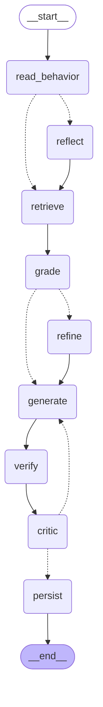

# Reckon

**A behavioural recommendation agent for the SmartReco Build Challenge 2026.**

Dead reckoning is navigating from your last known position plus heading and
elapsed time. That is literally what this app computes for each learner — and
*to reckon* is also to believe, which is what it holds about you.

---

## The idea in one line

**Two tiers of memory, and the cheap one decides when the expensive one gets to think.**

The brief judges *"be smart about when and how often you call the AI."* Most
answers to that are a counter — every N clicks, ask the model. This one is a
mechanism.

| | **Fast tier** — `app/intent.py` | **Slow tier** — `app/dossier.py` |
|---|---|---|
| What | A time-decayed weighted sum of the embeddings of everything you touch | 4–8 typed **claims** the agent believes about you |
| Cost | Pure numpy over cached vectors. **Zero** LLM calls, runs on every event | 1 LLM call, and only when the fast tier says you changed course |
| Job | Drives retrieval, and computes **drift** | Makes the persuasion specific, and lets you argue back |

**Drift** is the cosine distance between your intent vector now and the one the
agent last reasoned about. Small drift means nothing changed and the agent stays
asleep. That threshold is calibrated, not guessed:

| Behaviour | Drift | Wakes the agent? |
|---|---|---|
| AI/ML → Finance (a real pivot) | **0.2094** | yes |
| Data Engineering → Data Engineering (going deeper) | **0.0685** | no |

A genuine change of course scores **3× a deeper dive**, and the 0.15 threshold
sits between them. Reproduce it with
`uv run python scripts/simulate_users.py --report`.

Neither tier is novel and the code says so — see [Prior art](#prior-art). The
pairing, made visible, is the submission.

---

## Requirement → file

| Brief requirement | Where |
|---|---|
| 1. Platform, email/password auth, user + admin roles, related schema | [`app/auth.py`](app/auth.py), [`app/db.py`](app/db.py) |
| 2. Product CRUD, **dual-write to SQL + vector DB, kept in sync** | [`app/routes/admin.py`](app/routes/admin.py), [`app/vectors.py`](app/vectors.py) |
| 3. Behavioural tracking, **batched and non-blocking** | [`app/static/js/track.js`](app/static/js/track.js), [`app/routes/api.py`](app/routes/api.py) |
| 4. Agentic RAG engine grounded in the real catalog | [`app/agent.py`](app/agent.py), [`app/retrieval.py`](app/retrieval.py), [`app/intent.py`](app/intent.py), [`app/dossier.py`](app/dossier.py) |
| 5. **Efficient AI triggering + caching** | [`app/intent.py`](app/intent.py) (drift gate, atomic claim), [`app/mesh.py`](app/mesh.py) (three cache layers) |
| ⭐ Structured agent framework (LangGraph) | [`app/agent.py`](app/agent.py) — 9 nodes, 2 conditional branches, 2 bounded loops |
| ⭐ Scheduled proactive delivery | [`app/scheduler.py`](app/scheduler.py), [`app/notify.py`](app/notify.py) — APScheduler + SMTP |
| ⭐ Observability | [`app/mesh.py`](app/mesh.py) (LangSmith), [`app/routes/api.py`](app/routes/api.py) `/api/trace` + [Agent Cam](app/static/js/agentcam.js) |
| ⭐ Retrieval polish | [`app/retrieval.py`](app/retrieval.py) — hybrid dense + BM25, RRF, metadata filters, negative probes |

**Every LLM and embedding call goes through Mesh API.** [`app/mesh.py`](app/mesh.py)
is the only place a client is constructed, and there is no provider branch
anywhere: developing against OpenAI directly is an env-var swap.

---

## Setup

Needs Python 3.11 and [uv](https://docs.astral.sh/uv/). Only a Mesh key is required.

```bash
uv sync                                   # installs from the committed lockfile
cp .env.example .env                      # then set MESH_API_KEY
uv run python scripts/check_mesh.py       # verifies the key, models and schemas
uv run python scripts/seed_db.py --admin you@example.com --password yourpassword
uv run uvicorn app.main:app --port 8000   # use --reload while developing
```

Open http://127.0.0.1:8000 and sign in.

`data/catalog.json` is committed on purpose, so seeding needs no HuggingFace
download and no enrichment spend — one embeddings call per 96 courses and you
have a working app.

> Run this app with **one uvicorn worker**. The scheduler is in-process and the
> per-user intent lock is in-memory; both assume it. See the `ponytail:` notes in
> `app/scheduler.py` and `app/intent.py` for the upgrade path.

---

## Architecture

```
Browser ──track.js (buffer → sendBeacon)──► POST /api/events ──202 immediately
                                                   │
                                          BackgroundTask
                                                   ▼
                                     intent.apply_events()      ← no LLM, ever
                                        decay · add · drift
                                                   │
                                     should_fire()? ── no ──► done, 0 calls
                                                   │ yes
                                          intent.try_claim()    ← atomic, one winner
                                                   ▼
                                        LangGraph agent
```

The agent, rendered by LangGraph itself (`GRAPH.get_graph().draw_mermaid()`) —
Agent Cam shows this same graph with the executed path lit up:



| Node | LLM | Does |
|---|---|---|
| `read_behavior` | — | Raw events → a readable summary |
| `should_reflect` | — | *Decides whether* rewriting beliefs is worth a call |
| `reflect` | ✓ | Rewrites the dossier claims |
| `retrieve` | — | Hybrid multi-probe + RRF |
| `grade` | ✓ | *Evaluates retrieval quality* |
| `refine` | — | Re-probes with a hypothetical description (**max 1**) |
| `generate` | ✓ | Writes the recommendation |
| `verify` | — | Drops any product id not in the candidate set |
| `critic` | ✓ | Adversarial read; can bounce the draft back (**max 1**) |
| `persist` | — | Stores it and resets the drift baseline |

**Budget: 5 LLM calls worst case, 3 typical, 2 minimum.**

---

## What makes it not a template

**Retrieval is hybrid, and it earns it.** Dense embeddings are reliably bad at
rare proper nouns — search "PySpark" or "CISSP" and you get *thematically
similar* courses instead of the one with that word in the title. SQLite ships
FTS5, so BM25 costs no dependency. Fusion is RRF precisely *because* BM25 scores
and cosine distances share no scale; only rank position is comparable.

**Grounding is enforced, not hoped for.** `verify` drops any product id the model
invented, backfills from real candidates, and the test asserts it.

**You can argue with the agent.** The dossier is shown as claims with the
evidence behind each one, and every claim has a `×`. A `+interest` claim *is* a
retrieval probe, so striking it removes that probe and the picks re-deal
instantly — **zero LLM calls**, enforced by a test that makes `mesh.chat` raise.

**The interface never narrates the mechanism.** No "AI is thinking", no drift
number in the chrome. A hairline under the header tilts as your interests move
and flushes magenta when the agent wakes. The words *AI, agent, LLM, vector,
embedding, drift* appear nowhere in the UI — only in Agent Cam, which is
deliberately the one dark surface in the app.

**Agent Cam is the honesty check.** Trigger, drift vs threshold, every probe and
its hits, candidate RRF scores, the grader's verdict, which ids survived
verification, per-node latency, token counts, cache hits. All from the stored
trace of a real run.

---

## Efficiency

Three cache layers, cheapest first:

| Layer | Effect |
|---|---|
| In-process LRU (`app/mesh.py`) | chat **403ms → 0ms**, embeddings **2470ms → 0ms** |
| `embed_cache` in SQLite | survives restarts; unchanged product text is never re-embedded |
| Mesh gateway cache | `x-cache: HIT`, zero tokens billed |

Memoising chat is only safe because no temperature is ever sent — the request is
deterministic by construction. A degraded (prose) response is deliberately never
cached.

On top of that: the drift gate keeps the agent asleep, `should_reflect` skips the
reflection call on volume/stale triggers, and `try_claim()` stops concurrent
event batches from firing duplicate runs.

---

## Testing

```bash
uv run pytest                                   # 55 tests
uv run python scripts/simulate_users.py         # personas through the real endpoints
uv run python scripts/simulate_users.py --report  # drift calibration table
```

Tests run against isolated stores, so they cannot touch the seeded catalog. The
ones worth reading are the guards:

- `test_intent.py` — decay, drift, every trigger, and **three concurrency
  regressions**: the thundering herd, lost vector updates, and the cooldown race.
- `test_dualwrite.py` — a full create → semantic search → unpublish → republish →
  delete cycle, asserting all three stores agree at the end.
- `test_agent.py` — the graph's shape and its **cost ceiling**.
- `test_dossier.py` — striking a claim changes retrieval and calls no LLM.
- `test_digest.py` — that we do **not** email people who never opted in.

---

## Data

284 courses. 264 are real rows from
[azrai99/coursera-course-dataset](https://huggingface.co/datasets/azrai99/coursera-course-dataset)
(Apache-2.0), enriched with category, level, INR pricing and prerequisite edges.
20 are generated to floor thin categories and build three Beginner→Advanced
ladders — labelled `provider: "Reckon Originals"`, not disguised as real data.

Regenerate from scratch (costs money, needs network — normally unnecessary):

```bash
uv run python scripts/download_catalog.py     # HF CSV → sampled raw
uv run python scripts/enrich_catalog.py       # category/level/price/prereqs
uv run python scripts/generate_synthetic.py   # ladders + thin-category top-up
uv run python scripts/seed_db.py              # → SQLite + FTS5 + Chroma
uv run python scripts/reindex.py              # after any EMBED_MODEL change
```

`reindex.py` is not optional after changing the embedding model. Cache keys are
model-scoped, so a stale index makes every lookup miss and the recommender
silently degrades to nothing. Startup checks coverage and says so loudly.

---

## Stack

FastAPI · Jinja2 · SQLite (WAL + FTS5) · Chroma · LangGraph · APScheduler ·
LangSmith · Mesh API. No pandas, no passlib, no BM25 library, no charting
library — stdlib and SQLite cover those.

## Prior art

Nothing here is claimed as novel; the mechanisms are cited in the source.

- Drift-gated invocation — event-driven triggering on drift signals with a
  cooldown and a minimum-event gap — [arXiv:2606.07846](https://arxiv.org/pdf/2606.07846),
  [arXiv:2605.27428](https://arxiv.org/pdf/2605.27428)
- Time-decayed session vectors — [Springer](https://link.springer.com/chapter/10.1007/978-3-032-30524-4_37)
- User-as-vector with a negative term for rejections — Rocchio relevance feedback (1971)
- Reflection memory and evolving agent profiles — [arXiv:2607.07108](https://arxiv.org/pdf/2607.07108),
  [arXiv:2601.16872](https://arxiv.org/pdf/2601.16872)
- Visible, editable, contestable profiles — [From Hidden Profiles to Governable
  Personalization](https://arxiv.org/pdf/2604.20065)
- Transparency as a first-class outcome — [MATRAG, WWW '26](https://arxiv.org/abs/2604.20848)
